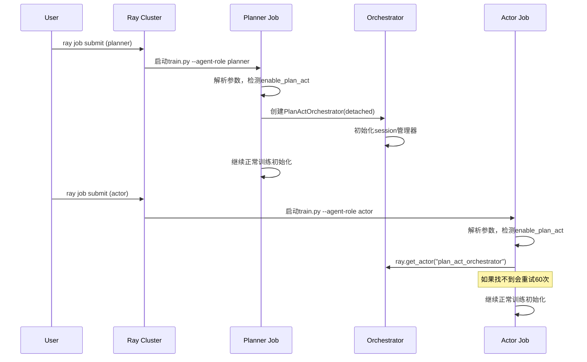
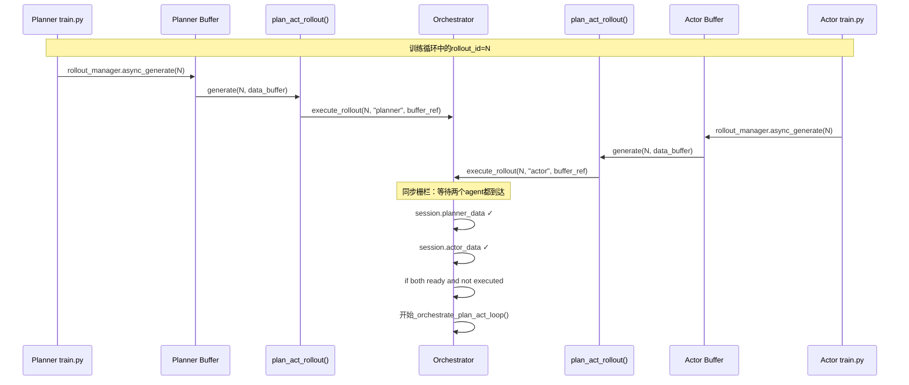
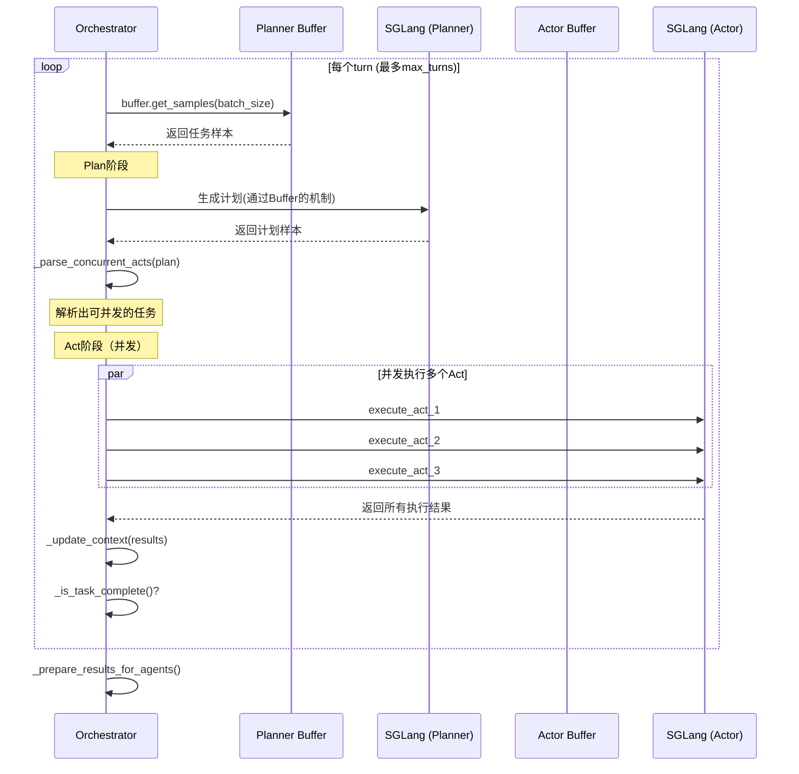
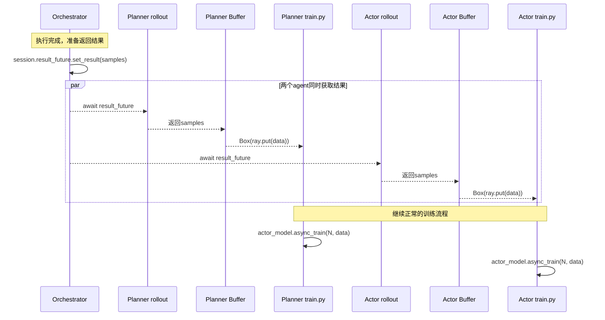
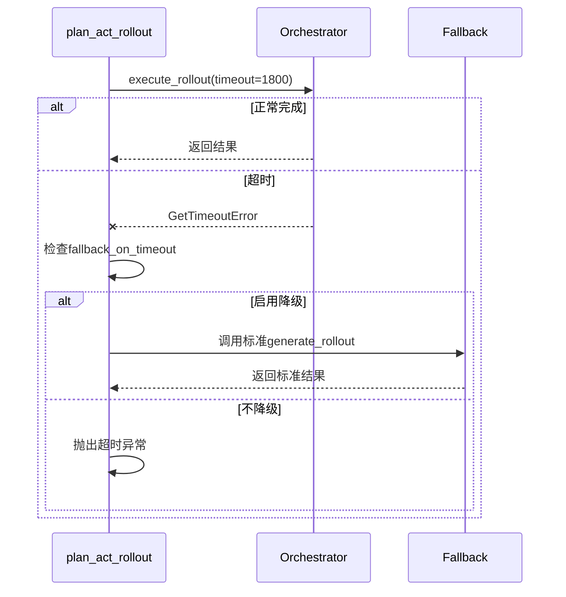
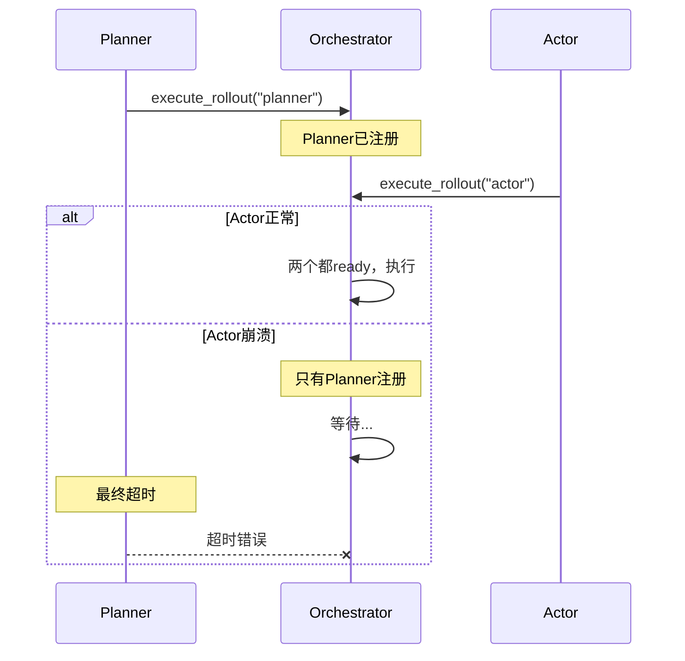

# Plan/Act 执行时序详解

## 1. 启动阶段时序



## 2. Rollout生成阶段时序



## 3. Plan/Act协调执行时序



## 4. 结果返回阶段时序



## 5. 异常处理时序

### 5.1 超时处理



### 5.2 Agent崩溃处理



## 6. 关键数据流

### 6.1 Sample数据流转

```
用户任务(Buffer) 
    ↓
Planner生成计划(Sample格式)
    ↓
Orchestrator解析和分发
    ↓
Actor执行任务(Sample格式)
    ↓
Orchestrator整合所有Sample
    ↓
返回给两个Job用于训练
```

### 6.2 Session状态管理

```python
RolloutSession {
    rollout_id: int
    planner_data: {arrived_at, buffer_ref}
    actor_data: {arrived_at, buffer_ref}
    result_future: asyncio.Future
    executed: bool
    created_at: float
}
```

## 7. 性能特征

### 7.1 延迟分析

- **启动延迟**：Actor等待Orchestrator创建，最多5分钟
- **同步延迟**：取决于两个job的执行速度差异
- **通信延迟**：Ray actor调用，通常<10ms
- **总体开销**：相比独立训练，增加5-10%的时间

### 7.2 并发特性

- **Rollout级并发**：不同rollout_id可以并发处理
- **Turn内并发**：多个Act可以并发执行
- **Job间独立**：两个job的其他操作（如梯度计算）完全独立

## 8. 调试要点

### 8.1 日志位置

```bash
# Orchestrator日志
ray logs actor --name plan_act_orchestrator

# Job日志
ray job logs <job_id>

# Ray系统日志
/tmp/ray/session_latest/logs/
```

### 8.2 关键检查点

1. **Orchestrator创建**：查看Planner日志确认创建成功
2. **Agent注册**：Orchestrator日志显示两个agent到达
3. **同步等待**：检查是否有agent未到达导致阻塞
4. **结果返回**：确认samples格式正确